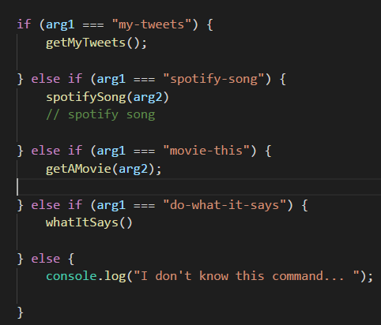

# LIRI  

I Created a language interpretation and recognition interface using NODE JS called LIRI (which is like iPhone's SIRI). Liri is a command line app that takes in parameters and gives you back data.

I have programmed LIRI to display my latest tweets, get songs from spotify, and send OMDB requests using the respective API's.
 In addition I use several NPM packages (node package manager) including node-omdb, node-spotify-api, request, and twitter which I require in my javascript file. Most of my code is in the liri.js file except for the identification keys which are in the keys.js file.  Module.exports brings the information from the keys.js file into the main liri.js file.

One thing that is noteworthy is the use of the node property 'process.argv'. This property returns an array containing the command line arguments passed when the Node.js process was launched. For example:
We see here an if/else statement using the variables arg1 and arg2 which are defined as process.argv[2] and processargv[3] respectively. We start on two because the first argument [0] will be to execPath and the second argument[1] wil be to the JavaScript file being executed. 

This is a very fun application to play around with!

